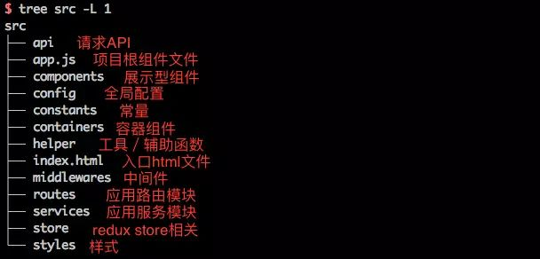

# Vue博客的重构
原地址[https://github.com/3072844942/blog](https://github.com/3072844942/blog)

> 介于博客非本人首创, 于是打算利用原有项目进行重构, 升级. 以此来锻炼个人能力

### 项目目录

### 项目日记
+ 2022/6/4 今天稍微写了点顶部状态栏, 并不理想, 但好歹实现了所有功能

### Bug记录
+ 2022/6/4 因为偷懒使用全局的transition, 导致状态栏动画不统一. 
同时, 因为不会写css, 导致本应合并的路径现在需要单独一个位置
+ 2022/6/5 主页大图, 底部及Loading界面, 因为想让加载一会(~~必须让大家看看我的努力~~), 
总体来说没有什么大问题, 就是加载过程缓慢, 是不是因为懒加载呢